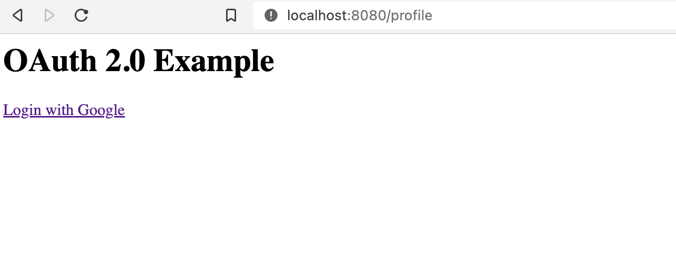

# google-oauth2-example
google-oauth2-example

# OAuth 2.0
OAuth 2.0 is an open standard used by many login services. If you’ve ever used a site or app that let you login using Twitter, Facebook, or other services, chances are it was using OAuth 2.0.

The idea behind OAuth 2.0 is that the user logs into a service like Google or Twitter and gives your code permission to do something on that service. For example, a user might login to Google and allow your code to create a Google doc, or they might login to Twitter and allow your code to post a tweet. This process of obtaining permission to access parts of a service is called authorization.

You can also use OAuth 2.0 to get information about a user, like their display name, profile picture, and a unique ID that identifies them. This process of identifying a user is called authentication.

Google provides an OAuth 2.0 server that lets users login, as well as a set of libraries that interact with that server. This tutorial uses Google’s OAuth 2.0 Java library to let users login using their Google accounts.

The Google OAuth 2.0 library lets you avoid handling registration and login yourself. Instead, you direct the user to Google’s login page, and then ask Google’s login page to redirect back to your page after the user logs in.

# OAuth 2.0 Client ID
Before you can use OAuth 2.0 in your code, you need to create an OAuth 2.0 Client ID, which is how Google’s OAuth 2.0 server identifies your code.

Follow the steps on OAuth documentation:

1. Open the Credentials page.
2. Click the Create Credentials button at the top, and then select OAuth client ID.
3. Choose Web application from the dropdown.
4. Give your client a name. This can be anything you want, and you can change it later.
5. The list of URIs on this page tells Google what URLs your code might want to redirect to after the user logs in. This prevents attackers from pretending to be you. For now, add http://localhost:8080/oauth2callback to the list of URIs.

Note the client ID and client secret on this screen.
6. Click the Save button!

# Environment Variables
The client ID and client secret from the previous step are like your username and password. You need to pass them into Google’s OAuth 2.0 Java library, but you should NOT store them in a public place like GitHub.

Instead, you can create environment variables that store your client ID and client secret, which you can then access in your code without exposing them publicly.

# Local
For testing locally, set the environment variables using the command line that you’ll use to run your local server.

# Windows:

set OAUTH_CLIENT_ID=YOUR_CLIENT_ID
set OAUTH_CLIENT_SECRET=YOUR_CLIENT_SECRET

